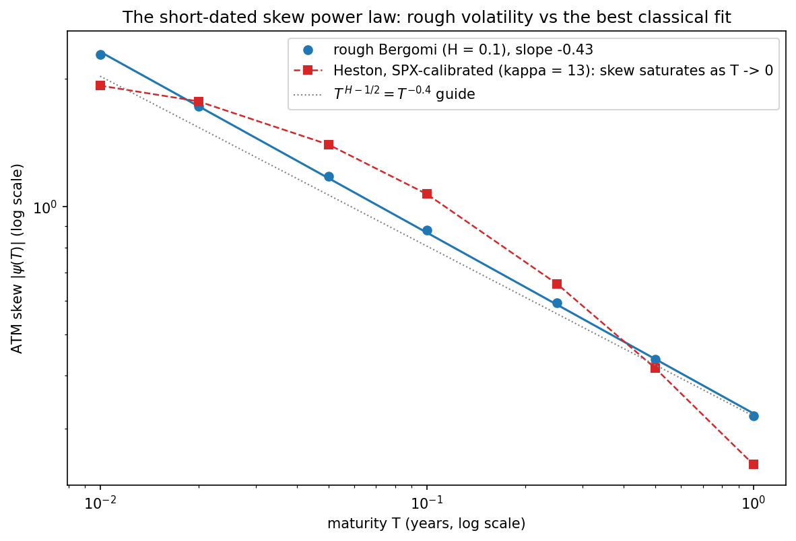
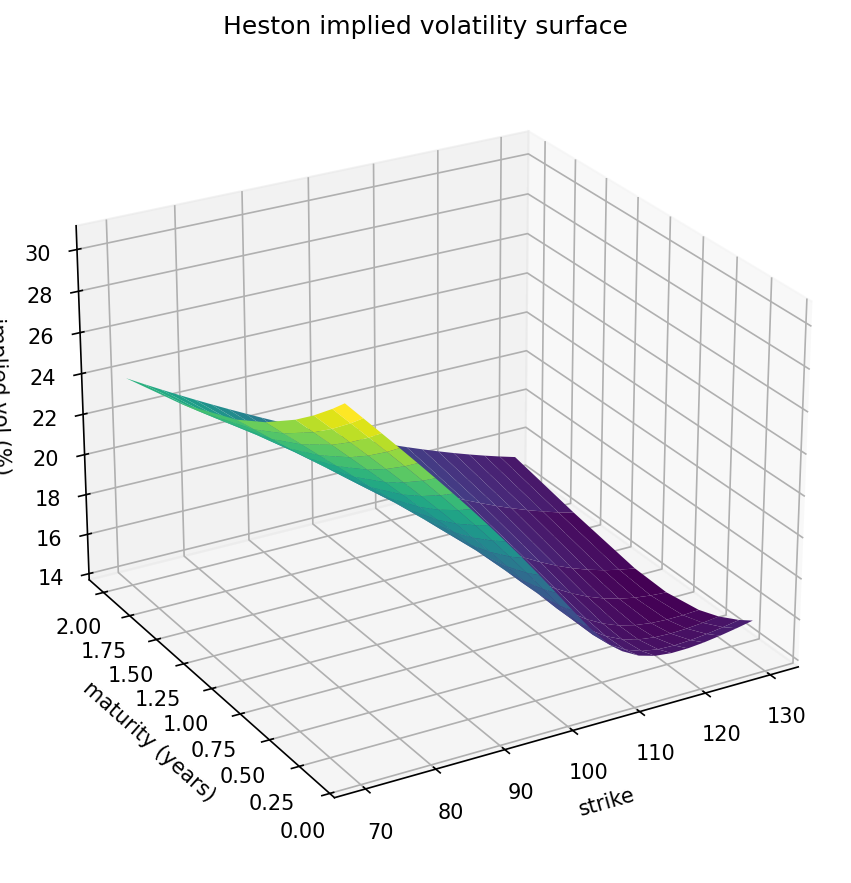

# Exotic Option Pricer

[](https://github.com/Miguelreey/exotic-option-pricer/actions/workflows/ci.yml)
[](https://github.com/Miguelreey/exotic-option-pricer/actions/workflows/ci.yml)
[](https://www.python.org/)
[](LICENSE)
[](https://github.com/astral-sh/ruff)
[](https://mypy-lang.org/)

Production-grade derivatives pricing library implementing analytical and numerical models used in institutional quantitative finance.

<p align="center">
  
</p>
<p align="center"><em>The short-dated ATM skew power law &psi;(T) &sim; T<sup>H&minus;1/2</sup>, measured in <a href="notebooks/05_rough_bergomi_skew.ipynb">notebook 05</a>: rough Bergomi holds the straight line (fitted slope &minus;0.43, theory &minus;0.4) exactly where the SPX-calibrated Heston saturates.</em></p>

## Phase 1: Black-Scholes-Merton Analytical Engine

Full implementation of the Black-Scholes-Merton (1973) model with:

- **16 Greeks** — first-order (delta, gamma, vega, theta, rho), second-order (vanna, volga, charm, speed, zomma, color), dual (dual_delta, dual_gamma), and utilities (probability ITM, elasticity)
- **Implied volatility solver** — Halley's method with cubic convergence (2-4 iterations), Brenner-Subrahmanyam initial guess, Brent fallback
- **Continuous dividend yield** — Merton (1973) extension throughout all methods
- **Vectorized computation** — scalar and NumPy array inputs, batch Greeks in single pass

## Phase 2: Monte Carlo Engine

Production Monte Carlo engine for derivative pricing under GBM dynamics:

- **3 SDE schemes** — exact (log-space, zero discretization error), Euler-Maruyama, Milstein (vectorized via cumsum)
- **Variance reduction** — antithetic variates, control variates, importance sampling, combined (up to 98% variance reduction)
- **Quasi-Monte Carlo** — scrambled Sobol sequences with O(1/N) convergence vs O(1/√N) for standard MC
- **Importance sampling** — optimal drift shift for deep OTM options, likelihood ratio correction (Glasserman §4.6)
- **Euler absorption** — clamp paths at zero for non-negative processes (prepares Heston/rBergomi)
- **Batch pricing** — `price_batch()` reuses simulated paths across multiple payoffs/strikes
- **Generic payoff API** — `price(payoff_fn, paths)` accepts any path-dependent payoff for exotic derivatives
- **Convergence analysis** — std_error vs N diagnostics with optional VR
- **Strong convergence verified** — Milstein O(dt), Euler O(sqrt(dt)), tested via shared Brownian motion
- **15 visualization functions** — price surfaces, Greeks panels, MC paths, convergence plots, VR comparison, exotic payoff diagrams

## Phase 3: Exotic Options

Four families of path-dependent exotic instruments with analytical closed forms and full Monte Carlo integration:

- **Asian options** — arithmetic and geometric averaging, fixed and floating strike. Kemna-Vorst (1990) closed form for geometric. Geometric-as-control-variate for arithmetic (>95% variance reduction)
- **Barrier options** — 8 types (up/down × in/out × call/put) with optional rebate. Reiner-Rubinstein (1991) closed form (components A-F). Broadie-Glasserman-Yor (1997) continuity correction for discrete monitoring
- **Lookback options** — floating and fixed strike, call and put. Goldman-Sosin-Gatto (1979) / Conze-Viswanathan (1991) closed forms. Dedicated L'Hôpital branch for zero-drift case (r = q)
- **Digital options** — cash-or-nothing and asset-or-nothing (4 types). Black-Scholes closed form. Vanilla decomposition identity: C = AoN_call - K × CoN_call
- **Numerical Greeks** — bump-and-revalue for delta, gamma, vega, theta, rho on any exotic. GBM path rescaling for delta/gamma (single simulation). Common random numbers via seed reset for vega/theta/rho
- **ExoticOption ABC** — unified `payoff(paths)` interface plugging directly into `MonteCarloEngine.price()`

## Phase 4: Heston Stochastic Volatility

Heston (1993) model with semi-closed-form pricing, industry-standard simulation and live market calibration:

- **Characteristic function** in the numerically stable "Little Heston Trap" formulation (Albrecher et al. 2007) — continuous for all maturities, with exact handling of the degenerate points u = 0, u = -i
- **Vanilla pricing** via Gil-Pelaez Fourier inversion (adaptive quadrature, pointwise) and **Carr-Madan FFT** (whole strike grid in one transform, Simpson weights, homogeneity-normalized) — cross-validated to < 3e-7
- **Moment-explosion guard** — closed-form explosion time T*(p) (Andersen-Piterbarg 2007) instead of a finiteness check, which the spurious analytic continuation would fool
- **QE simulation scheme** (Andersen 2008) — exact CIR conditional moments, quadratic/exponential branches with mass at zero (Feller violation handled natively), martingale correction (§4.3.3) on by default, fully vectorized over paths
- **Phase 3 exotics under stochastic volatility** — Asian/Barrier/Lookback/Digital price on Heston paths with zero code changes (`ExoticOption.payoff` is model-agnostic)
- **Greeks** — delta and gamma exact via the differentiated characteristic function (no bumping); vega defined as dV/d√v0; `model_greeks()` returns dV/d{v0, κ, θ, ξ, ρ}
- **Calibration to S&P 500** — implied-vol-space objective, exp/tanh reparametrization, deterministic multi-start least squares, optional Feller soft penalty, parity-implied forwards per expiry, vol-time expiry sampling, liquidity filtering. Calibrated live to 1,718 SPX options across 8 expiries: RMSE 1.3 vol pts
- **External validation** — 89 reference prices pinned against QuantLib's `AnalyticHestonEngine`: max deviation 1.6e-8

## Phase 5: Rough Bergomi

Bayer-Friz-Gatheral (2016) rough volatility — the model class that reproduces the short-dated ATM skew power law psi(T) ~ T^(H-1/2) that no classical stochastic-volatility model can:

- **Two independent Volterra simulations, cross-validated** — exact joint Cholesky factorization (internal gold standard: rBergomi has no QuantLib-style external benchmark) and the Bennedsen-Lunde-Pakkanen (2017) hybrid scheme with exact treatment of the singular kernel on the latest interval + FFT causal convolution, O(paths n log n)
- **Conditional Black-Scholes pricing** (McCrickerd-Pakkanen 2018) — the orthogonal Brownian dimension integrated out analytically, plus an exact-mean control variate on the conditional forward: ~0.4x the plain-MC standard error at SPX-style parameters, collapsing to the Phase 1 BS price with zero variance as eta -> 0
- **Exact martingale discretization** — the left-point log-Euler forward is exact for any step count (verified at n = 50 and n = 500); antithetic variates supported (the Gaussian map is linear, unlike Heston QE)
- **The skew power law, measured** — log-log slope -0.43 for H = 0.1 (theory: H - 1/2 = -0.4) over T in [0.05, 1], persisting at -0.41 on [0.01, 0.05] where the Phase 4 SPX-calibrated Heston saturates to -0.20: the structural motivation for rough volatility
- **Greeks under exact common random numbers** — delta/gamma by path rescaling (rBergomi coefficients are spot-independent), vega = dV/d sqrt(xi0) via the exact v-proportional-to-xi0 scaling, `model_greeks()` = dV/d{xi0, eta, H, rho}
- **Phase 3 exotics on rough-volatility paths with zero code changes** — the model-agnostic `payoff(paths)` contract holds for its third model; IV surfaces via the Phase 1 Halley solver

### Roadmap

| Phase | Model | Status |
|-------|-------|--------|
| 1 | Black-Scholes analytical | **Complete** |
| 2 | Monte Carlo engine | **Complete** |
| 3 | Exotic options (Asian, Barrier, Lookback, Digital) | **Complete** |
| 4 | Heston stochastic volatility + SPX calibration | **Complete** |
| 5 | Rough Bergomi (rough volatility, hybrid scheme) | **Complete** |
| 6 | Showcase notebooks + repository polish | **In progress** |

## Showcase notebooks

Five executable notebooks in [`notebooks/`](notebooks/), each cross-checked in-cell with
asserts (parity gaps, z-scores against closed forms, fitted slopes vs theory). They run
offline end-to-end — no API keys, no market-data downloads.

| Notebook | What it shows |
|----------|---------------|
| [01 — Black-Scholes & Greeks](notebooks/01_black_scholes_greeks.ipynb) | Analytical engine: Hull anchors, 16 Greeks, gamma heatmap, IV solver round-trip below 1e-9 at ~70 &mu;s per price+invert |
| [02 — Monte Carlo & variance reduction](notebooks/02_monte_carlo_variance_reduction.ipynb) | Measured O(N<sup>&minus;1/2</sup>) convergence, antithetic/control/combined VR, scrambled Sobol QMC, importance sampling deep OTM |
| [03 — Exotic options](notebooks/03_exotic_options.ipynb) | Asian/Barrier/Lookback/Digital vs closed forms, BGY/BGK discrete-monitoring corrections, in-out parity, numerical Greeks with CRN |
| [04 — Heston](notebooks/04_heston_stochastic_volatility.ipynb) | Gil-Pelaez vs Carr-Madan FFT at 2.4e-7, QE simulation under Feller violation, smile family, IV surface, calibration round-trip |
| [05 — Rough Bergomi](notebooks/05_rough_bergomi_skew.ipynb) | Hybrid vs exact Cholesky cross-validation, rough volatility paths, the skew power law vs Heston saturation |

<p align="center">
  
</p>

## Quick Start

```python
import numpy as np
from src.models import BlackScholesModel
from src.engines import MonteCarloEngine

# Analytical pricing
bs = BlackScholesModel(sigma=0.20)
price = bs.price(S=100, K=100, T=1.0, r=0.05, option_type='call')
# 10.4506

# All 16 Greeks in one pass
greeks = bs.greeks(S=100, K=100, T=1.0, r=0.05, option_type='call')
# {'price': 10.45, 'delta': 0.637, 'gamma': 0.019, 'vega': 37.52, ...}

# Implied volatility from market price
iv = BlackScholesModel.implied_vol(
    price_market=10.45, S=100, K=100, T=1.0, r=0.05, option_type='call'
)
# 0.2000

# Monte Carlo pricing with variance reduction
mc = MonteCarloEngine(n_paths=500_000, seed=42)
result = mc.price_european(100, 100, 1.0, 0.05, 0.20, 'call',
                           antithetic=True, control_variate=True)
# MCResult(price=10.4494, std_error=0.0029, CI=[10.4437, 10.4551], vr='antithetic+control')

# Exotic option pricing with variance reduction
from src.instruments import AsianOption, BarrierOption, LookbackOption, DigitalOption

asian = AsianOption(K=100, option_type='call', avg_type='arithmetic')
mc = MonteCarloEngine(n_paths=500_000, seed=42)
paths = mc.simulate_gbm(100, 1.0, 0.05, 0.20, n_steps=252)
cv_fn = asian.geometric_control_fn(100, 1.0, 0.05, 0.20, n_obs=252)
result = mc.price(asian.payoff, paths, 0.05, 1.0, control_fn=cv_fn)
# MCResult(price=5.55, std_error=0.002, vr='control')

# Numerical Greeks for any exotic
from src.utils.greeks import numerical_greeks
greeks = numerical_greeks(mc, asian.payoff, S0=100, T=1.0, r=0.05, sigma=0.20)
# {'delta': 0.58, 'gamma': 0.025, 'vega': 23.1, 'theta': -3.8, 'rho': 32.4}

# Heston stochastic volatility (Phase 4)
from src.models import HestonModel

heston = HestonModel(v0=0.04, kappa=2.0, theta=0.04, xi=0.5, rho=-0.7)
price = heston.price(100, 100, 1.0, 0.05, 'call')          # Fourier (Gil-Pelaez)
surface = heston.price_surface(100, np.arange(70, 131), 1.0, 0.05)  # Carr-Madan FFT

# Exotics under stochastic volatility: same instruments, Heston paths
paths = mc.simulate_heston(100, 0.04, 1.0, 0.05,
                           kappa=2.0, theta=0.04, xi=0.5, rho=-0.7, n_steps=252)
result = mc.price(asian.payoff, paths, 0.05, 1.0)

# Calibrate to a market implied-vol surface
from src.calibration import HestonCalibrator

cal = HestonCalibrator(S0=100.0, r=0.03, q=0.01)
fit = cal.calibrate(strikes, maturities, market_ivs)
# CalibrationResult(v0=0.0327, kappa=..., rho=-0.64, rmse_iv=1.3 vol pts, ...)

# Rough Bergomi (Phase 5): the short-dated skew power law psi(T) ~ T^(H-1/2)
from src.models import RoughBergomiModel

rb = RoughBergomiModel(xi0=0.04, eta=1.9, H=0.1, rho=-0.9)
price = rb.price(100, 100, 1.0, 0.05, 'call')       # conditional-BS Monte Carlo
ivs = rb.iv_surface(100, np.arange(80, 121, 5), [0.1, 0.5, 1.0], 0.05)

# Exotics on rough-volatility paths: same instruments, zero code changes
paths = rb.simulate(100, 1.0, 0.05, n_paths=100_000, n_steps=252)
result = mc.price(asian.payoff, paths, 0.05, 1.0)
```

## Installation

```bash
git clone https://github.com/Miguelreey/exotic-option-pricer.git
cd exotic-option-pricer
pip install -e ".[dev]"
```

## Testing

```bash
pytest
```

977 tests validate correctness through multiple independent methods:

| Suite | Tests | What it validates |
|-------|-------|-------------------|
| `test_pricing.py` | 178 | Hull benchmarks, put-call parity, boundary conditions, FD Greeks, BS PDE, homogeneity, no-arbitrage bounds |
| `test_properties.py` | ~3,000 | 8 mathematical invariants across random parameter sets (Hypothesis) |
| `test_benchmark.py` | 13 | 7,500-point grid vs independent reference, BS + MC throughput |
| `test_monte_carlo.py` | 127 | GBM distributions, Euler/Milstein strong convergence, MC vs BS cross-validation, VR (antithetic+control+IS), QMC, Euler absorption, batch pricing, Q-martingale |
| `test_exotics.py` | 240 | 4 exotic instruments: MC vs analytical cross-validation, in-out parity, AM≥GM, complementarity, vanilla decomposition, boundary conditions, Greeks vs BS, Hypothesis (6,000+ random cases) |
| `test_heston.py` | 215 | CF anchors (φ(0)=1, φ(-i)=forward), BS limit, 89 QuantLib reference prices, Gil-Pelaez vs FFT, moment-explosion threshold, QE exact CIR moments + martingale, exotics under Heston, smile/skew, calibration round-trips, Hypothesis (~2,000 random cases) |
| `test_rough_bergomi.py` | 126 | Volterra covariance quadrature vs exact anchors, hybrid vs exact Cholesky on prices, exact left-point martingale, BS limit (deterministic to 1e-8), skew power law T^(H-1/2) + Heston saturation contrast, exotics on rough paths, Hurst roundtrip, Hypothesis |
| `test_strategies.py` | 10 | Straddle delta-neutrality, butterfly bounds, Greeks linearity, delta-hedge P&L |
| `test_visualization.py` | 19 | All 15 visualization functions, exotic payoff diagrams, figure cleanup |

## Architecture

```
src/
├── models/
│   ├── base.py              # ABC PricingModel interface
│   ├── black_scholes.py     # BS-Merton analytical engine (16 Greeks)
│   ├── heston.py            # Heston: Little-Trap CF, Gil-Pelaez + Carr-Madan FFT
│   └── rough_bergomi.py     # Rough Bergomi: hybrid scheme + conditional MC
├── engines/
│   ├── monte_carlo.py       # MC engine: GBM + Heston QE simulation, generic pricing
│   └── variance_reduction.py # Antithetic, control variates, importance sampling
├── instruments/
│   ├── base.py              # ABC ExoticOption interface
│   ├── asian.py             # Asian options: Kemna-Vorst CV, arithmetic/geometric
│   ├── barrier.py           # Barrier options: Reiner-Rubinstein, BGY correction
│   ├── lookback.py          # Lookback options: Goldman-Sosin-Gatto, L'Hôpital
│   └── digital.py           # Digital options: cash/asset-or-nothing
├── utils/
│   ├── visualization.py     # 15 visualization functions
│   └── greeks.py            # Numerical Greeks: bump-and-revalue, CRN, path rescaling
└── calibration/
    ├── heston_calibrator.py # IV-space least squares, multi-start, Feller penalty
    └── market_data.py       # SPX chain download + cleaning (optional yfinance)
```

All pricing models inherit from `PricingModel` (abstract base class), ensuring interchangeability in portfolio valuation, calibration, and risk management.

## Greeks Reference

| Greek | Order | Formula | Description |
|-------|-------|---------|-------------|
| Delta | 1st | dV/dS | Spot sensitivity |
| Gamma | 1st | d²V/dS² | Delta convexity |
| Vega | 1st | dV/dσ | Volatility sensitivity |
| Theta | 1st | dV/dt | Time decay |
| Rho | 1st | dV/dr | Rate sensitivity |
| Vanna | 2nd | d²V/(dS·dσ) | Delta-vol cross |
| Volga | 2nd | d²V/dσ² | Vega convexity |
| Charm | 2nd | dΔ/dT | Delta decay |
| Speed | 2nd | dΓ/dS | Gamma sensitivity to spot |
| Zomma | 2nd | dΓ/dσ | Gamma sensitivity to vol |
| Color | 2nd | dΓ/dt | Gamma decay |
| Dual Delta | Dual | dV/dK | Strike sensitivity |
| Dual Gamma | Dual | d²V/dK² | Breeden-Litzenberger density |

## References

- Black & Scholes (1973). *The Pricing of Options and Corporate Liabilities.* JPE 81(3).
- Merton (1973). *Theory of Rational Option Pricing.* Bell J. Econ. 4(1).
- Hull (2018). *Options, Futures, and Other Derivatives.* 10th ed.
- Haug (2007). *The Complete Guide to Option Pricing Formulas.* 2nd ed.
- Jaeckel (2017). *Let's Be Rational.* Wilmott.
- Glasserman (2003). *Monte Carlo Methods in Financial Engineering.* Springer.
- Kemna & Vorst (1990). *A Pricing Method for Options Based on Average Asset Values.* J. Banking & Finance 14.
- Reiner & Rubinstein (1991). *Breaking Down the Barriers.* Risk 4(8).
- Goldman, Sosin & Gatto (1979). *Path Dependent Options: Buy at the Low, Sell at the High.* J. Finance 34(5).
- Conze & Viswanathan (1991). *Path Dependent Options: The Case of Lookback Options.* J. Finance 46(5).
- Broadie, Glasserman & Kou (1997). *A Continuity Correction for Discrete Barrier Options.* Math. Finance 7(4).
- Kloeden & Platen (1992). *Numerical Solution of Stochastic Differential Equations.* Springer.
- Heston (1993). *A Closed-Form Solution for Options with Stochastic Volatility.* RFS 6(2).
- Albrecher, Mayer, Schoutens & Tistaert (2007). *The Little Heston Trap.* Wilmott.
- Andersen (2008). *Simple and Efficient Simulation of the Heston Stochastic Volatility Model.* J. Comp. Finance 11(3).
- Carr & Madan (1999). *Option Valuation Using the Fast Fourier Transform.* J. Comp. Finance 2(4).
- Andersen & Piterbarg (2007). *Moment Explosions in Stochastic Volatility Models.* Finance & Stochastics 11(1).
- Keller-Ressel (2011). *Moment Explosions and Long-Term Behavior of Affine Stochastic Volatility Models.* Math. Finance 21(1).
- Bayer, Friz & Gatheral (2016). *Pricing under Rough Volatility.* Quant. Finance 16(6).
- Bennedsen, Lunde & Pakkanen (2017). *Hybrid Scheme for Brownian Semistationary Processes.* Finance & Stochastics 21(4).
- McCrickerd & Pakkanen (2018). *Turbocharging Monte Carlo Pricing for the Rough Bergomi Model.* Quant. Finance 18(11).
- Gatheral, Jaisson & Rosenbaum (2018). *Volatility is Rough.* Quant. Finance 18(6).
- Fukasawa (2011). *Asymptotic Analysis for Stochastic Volatility: Martingale Expansion.* Finance & Stochastics 15.

## License

MIT
